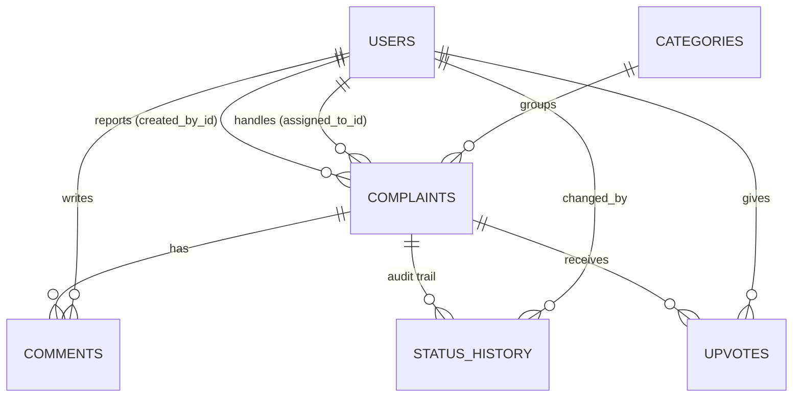

# CampusConnect — Campus Issue & Complaint Management System

A full-stack web app where students report campus problems (Wi-Fi, hostel, classrooms, transport…),
admins assign them to staff, and everyone tracks each complaint from **Open** to **Resolved**.

| Layer    | Tech |
|----------|------|
| Frontend | React 19 (Vite), React Router, Axios, **plain CSS** |
| Backend  | Java 17, Spring Boot 3.3, Spring Web, Spring Data JPA (Hibernate), Spring Security + JWT, Bean Validation |
| Database | MySQL 8 |

---

## Features

**Students**
- Sign up / log in (JWT, BCrypt-hashed passwords)
- Report an issue with category, priority, location and description
- Post **anonymously** (name hidden from everyone except admins) or keep a complaint **private**
- Campus feed of public complaints with search, filters, sorting and pagination
- **"Me too" upvotes** to show how many people are affected
- Confirm a fix (**close**) or **reopen** it with a reason

**Staff**
- "Assigned to me" queue
- Move complaints Open → In progress → Resolved (or Reject with a reason)
- Comment to keep the reporter updated

**Admins**
- Campus-wide dashboard: totals, active, resolved, **overdue**, average resolution time, by category, by priority
- Assign / reassign complaints to staff
- Create staff and admin accounts, disable / enable users
- Add, rename and hide categories

**Everywhere**
- Each priority has a resolution target (Urgent 24 h, High 3 days, Medium 7 days, Low 14 days); complaints past it are flagged **Overdue**
- Full **activity timeline** (who changed what, when, and why)
- Ticket numbers like `CC-2026-00042` (searchable)
- One consistent error format from the API: `{"error": "...", "message": "..."}` — never a stack trace
- Responsive layout (works on phones)

### Complaint workflow

```
            assigned staff / admin              reporter / admin
  OPEN ──────────────► IN_PROGRESS ──────────► RESOLVED ──────────► CLOSED
    │                       │                      │
    └──────► REJECTED ◄─────┘                      └──► IN_PROGRESS (reopen, reason required)
           (reason required)
```

---

## Project structure

```
campusconnect/
├── backend/                         Spring Boot REST API (port 8080)
│   ├── pom.xml
│   └── src/main/java/com/campusconnect/
│       ├── controller/              REST endpoints (HTTP in/out only)
│       ├── service/                 Business rules (ComplaintPolicy = who may do what)
│       ├── repository/              Spring Data JPA repositories
│       ├── model/                   JPA entities (tables)
│       ├── dto/                     Request / response objects + validation rules
│       ├── security/                JWT service + filter, JSON 401/403 handlers
│       ├── exception/               ApiException + GlobalExceptionHandler
│       └── config/                  SecurityConfig, DataSeeder (demo data)
│   └── src/main/resources/
│       ├── application.properties       MySQL settings
│       └── application-h2.properties    optional: run without MySQL
├── frontend/                        React app (port 5173)
│   ├── vite.config.js               proxies /api → http://localhost:8080
│   └── src/
│       ├── api/                     Axios client + API functions
│       ├── context/                 AuthContext (login state), ToastContext
│       ├── components/              Layout, badges, cards, pagination…
│       ├── pages/                   Login, Register, Dashboard, Complaints, New, Detail, Admin
│       ├── styles/                  base.css, layout.css, components.css, pages.css
│       └── utils/                   formatting + validation helpers
└── database/schema.sql              MySQL schema (reference — tables are auto-created)
```

---

## How to run (Windows CMD)

### 0. Install once
- **Java 17 or newer** (JDK) — check: `java -version`
- **Maven** — check: `mvn -v` (or use IntelliJ IDEA, which has Maven built in — see below)
- **Node.js 18 or newer** — check: `node -v`
- **MySQL 8** running on port 3306

### 1. Backend (terminal 1)

Open CMD in the folder where you unzipped the project:

```bat
cd campusconnect\backend
set DB_USERNAME=root
set DB_PASSWORD=your_mysql_password
mvn spring-boot:run
```

- The database `campusconnect` and all tables are created automatically on first run.
- Demo users, categories and 8 sample complaints are added automatically.
- Wait for `Started CampusConnectApplication`. Check http://localhost:8080/api/health → `{"status":"UP"}`

**No MySQL yet?** Run with the built-in in-memory database instead (data is lost when you stop it):

```bat
mvn spring-boot:run -Dspring-boot.run.profiles=h2
```

**Using IntelliJ IDEA?** File → Open → select `backend\pom.xml` → Open as Project. Edit the password in
`src\main\resources\application.properties` (`spring.datasource.password=...`) and run
`CampusConnectApplication.java` with the green ▶ button.

### 2. Frontend (terminal 2)

```bat
cd campusconnect\frontend
npm install
npm run dev
```

Open **http://localhost:5173**

> Mac / Linux: same commands, but use `/` in paths and `export DB_PASSWORD=...` instead of `set`.

### Demo logins

| Role    | Email                   | Password      |
|---------|-------------------------|---------------|
| Admin   | admin@campus.edu        | Admin@123     |
| Staff   | ravi.staff@campus.edu   | Staff@123     |
| Staff   | priya.staff@campus.edu  | Staff@123     |
| Student | student@campus.edu      | Student@123   |
| Student | rahul@campus.edu        | Student@123   |

The login page also has one-click buttons to fill these in.

### Run the backend tests

```bat
cd campusconnect\backend
mvn test
```

10 end-to-end API tests run against an in-memory database (no MySQL needed): login errors, validation,
the full complaint life cycle, private complaints, upvotes, role checks and dashboard numbers.

---

## Configuration

Backend settings (`backend/src/main/resources/application.properties`) can be overridden with environment variables:

| Variable       | Default                                   | Meaning |
|----------------|-------------------------------------------|---------|
| `DB_URL`       | `jdbc:mysql://localhost:3306/campusconnect?createDatabaseIfNotExist=true&...` | MySQL connection |
| `DB_USERNAME`  | `root`                                    | MySQL user |
| `DB_PASSWORD`  | `root`                                    | MySQL password |
| `JWT_SECRET`   | dev value                                 | Secret for signing login tokens — **change it for real use** (32+ characters) |
| `CORS_ORIGINS` | `http://localhost:5173,http://127.0.0.1:5173` | Allowed frontend origins |

Set `app.seed.enabled=false` to start with an empty database.

Frontend: by default it calls `/api`, which Vite forwards to `http://localhost:8080`.
To point it elsewhere, copy `frontend/.env.example` to `frontend/.env` and set `VITE_API_URL`.

---

## Database design



- `users.email`, `categories.name` are UNIQUE; `upvotes (complaint_id, user_id)` is UNIQUE (one vote per person)
- `status_history` is append-only — the full story of every complaint
- `upvote_count` is changed only with an atomic `UPDATE … SET upvote_count = upvote_count + 1`
- Indexes on status, reporter, assignee and created date for fast lists and dashboards
- Full DDL: [`database/schema.sql`](database/schema.sql)

---

## REST API

All endpoints except login, register and health need the header `Authorization: Bearer <token>`.

| Method | Endpoint | Who | Purpose |
|--------|----------|-----|---------|
| POST | `/api/auth/register` | public | Create a student account → token |
| POST | `/api/auth/login` | public | Log in → token |
| GET | `/api/auth/me` | any | Current user |
| GET | `/api/dashboard` | any | Stats (admin: all, staff: assigned, student: own) |
| GET | `/api/complaints` | any | List — `scope` (all/mine/assigned), `status`, `categoryId`, `priority`, `q`, `sort` (newest/oldest/upvotes/priority/due), `page`, `size` |
| POST | `/api/complaints` | any | Create a complaint |
| GET | `/api/complaints/{id}` | can view | Details + comments + history + allowed actions |
| PATCH | `/api/complaints/{id}/status` | per workflow | `{"status": "IN_PROGRESS", "note": "…"}` |
| PATCH | `/api/complaints/{id}/assign` | admin | `{"staffId": 2}` |
| POST | `/api/complaints/{id}/comments` | reporter, assignee, admin | `{"message": "…"}` |
| POST / DELETE | `/api/complaints/{id}/upvote` | anyone except reporter | Add / remove "me too" |
| GET | `/api/categories` | any | Active categories (`?all=true` for admins) |
| POST / PUT | `/api/categories`, `/api/categories/{id}` | admin | Create / edit / hide |
| GET / POST | `/api/users` | admin | List (`?role=STAFF`) / create staff or admin |
| PATCH | `/api/users/{id}/status` | admin | `{"active": false}` |
| GET | `/api/health` | public | `{"status":"UP"}` |

### Error format

```json
{ "error": "INVALID_TRANSITION", "message": "A complaint can't move from open to resolved.", "path": "/api/complaints/3/status", "timestamp": "..." }
```

| Status | error | When |
|--------|-------|------|
| 400 | `VALIDATION_ERROR` (+ `details` per field) | Missing / invalid fields |
| 400 | `MALFORMED_REQUEST`, `INVALID_PARAMETER`, `NOTE_REQUIRED` | Bad JSON, bad query value, reject/reopen without reason |
| 401 | `UNAUTHORIZED`, `INVALID_CREDENTIALS` | Not logged in / expired token / wrong email or password |
| 403 | `FORBIDDEN`, `ACCOUNT_DISABLED` | Not allowed for your role or this complaint |
| 404 | `NOT_FOUND` | Unknown id (private complaints you can't see also return 404) |
| 409 | `EMAIL_ALREADY_EXISTS`, `INVALID_TRANSITION`, `ALREADY_UPVOTED`, `CONFLICT`… | Duplicates or invalid state changes |
| 500 | `INTERNAL_ERROR` | Unexpected — message has a reference id; details only in the server log |

---

## Security notes
- Passwords hashed with BCrypt; JWT (HS256) expires after 24 hours
- Same error for wrong email and wrong password (no account probing)
- Role checks on the server (`@PreAuthorize` + `ComplaintPolicy`); the UI only hides buttons
- Private complaints return 404 to users who can't see them
- Stateless API, CORS limited to the frontend origin, no stack traces in responses
- Change `JWT_SECRET` and the demo passwords before any real deployment

## Troubleshooting

| Problem | Fix |
|---------|-----|
| `Access denied for user 'root'@'localhost'` | Wrong MySQL password — `set DB_PASSWORD=...` before `mvn spring-boot:run` |
| `Communications link failure` | MySQL isn't running — start the MySQL service, or use the `h2` profile |
| `'mvn' is not recognized` | Install Maven and add it to PATH, or run from IntelliJ |
| Red box "Can't reach the server" in the app | Backend isn't running on port 8080 |
| `Port 8080 was already in use` | Stop the other app, or run `mvn spring-boot:run -Dspring-boot.run.arguments=--server.port=8081` and change the proxy target in `frontend/vite.config.js` |
| `npm error ENOENT package.json` | Run npm inside the `frontend` folder |
